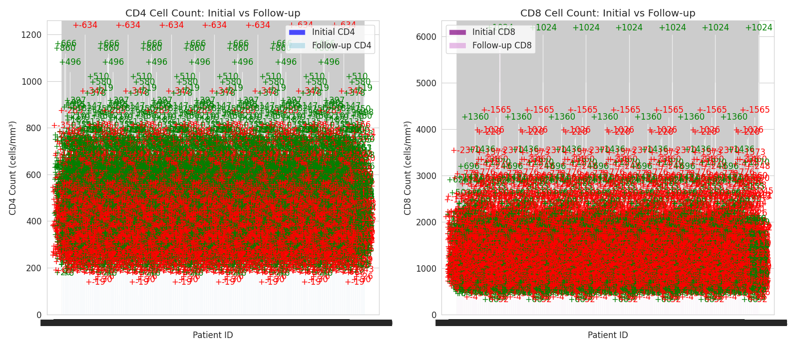
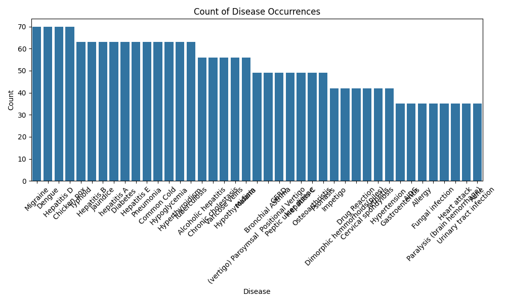
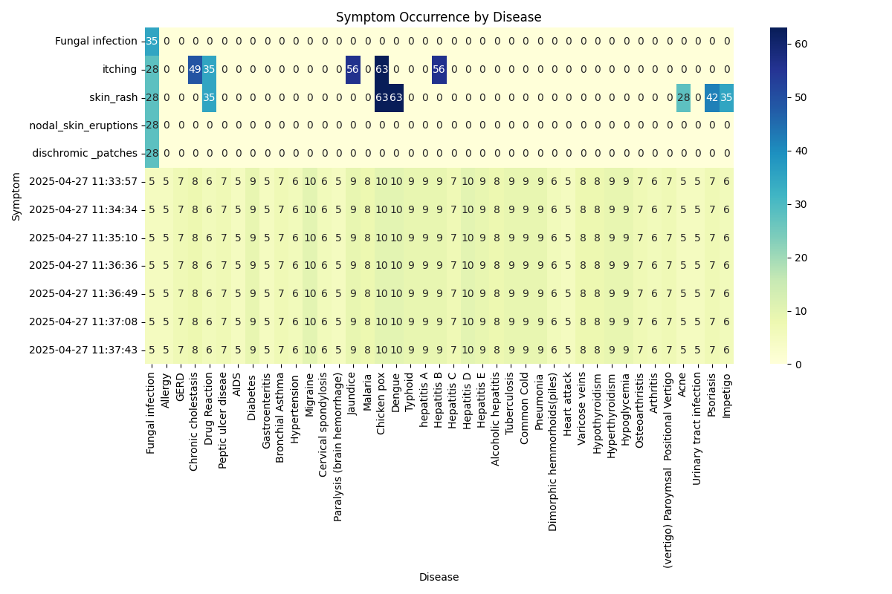

# Disease Data Analysis & Data Pipelining Project 

### Language  
Python3  
SQL  

---

### Visualizations  

- **`cd counts comparison`** 

– Bar chart comparing counts of chronic diseases across different categories.  

- **`clinical correlation heatmap`** 

– Heatmap showing correlation between clinical features and disease variables.  

- **`disease count`** 

– Overview of disease prevalence across the dataset.  

- **`patient characteristic radar`** 

– Radar chart summarizing key patient characteristics such as age, BMI, and vitals.  

- **`symptom disease heatmap`** 

– Heatmap displaying relationships between symptoms and diseases.  

- **`symptom distribution`** 

– Histogram showing frequency distribution of reported symptoms.  

- **`symptom frequency`** 

– Bar plot highlighting the most frequently reported symptoms.
---